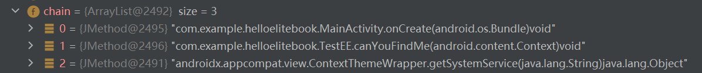

#### 如何获取指定APK中所调用方法的Call Chain

- 代码中使用此模块的方式：

  - 1：指定APK的路径

    此APK为您想分析提取的APK文件

  - 2：指定```Android.jar```包

    此jar包为Android SDK提供，如果您分析的APK的```targersdkversion```为29，那么您就需要提供API 29的```Android.jar```包，你可以在这里下载到：[点我](https://github.com/CirQ/android-platforms)

  代码示例如下：

  ```java
      @Test
      public void testMain() throws IOException, XmlPullParserException {
  
          Set<CallChain> resultsOfAPP = CallChainMain.getAllChains(Paths.get("apks/hello.apk"),Paths.get("D:\\AndroidEnviorment\\androidJAR"));
  
          FileUtil.writeCallchainsTo(resultsOfAPP,"resultsOfAPP.txt");
  
      }
  ```

- 得到的结果是什么形式？

  - 比如我们有一个简单的APK，在```MainAnctivity```中有代码如下：

    ```java
    public class MainActivity extends AppCompatActivity {
        @Override
        protected void onCreate(Bundle savedInstanceState) {
            super.onCreate(savedInstanceState);
            setContentView(R.layout.activity_main);
            TestEE te = new TestEE();
            te.canYouFindMe(this);
        }
    }
    ```

    并在```TestEE```中有代码如下：

    ```java
    public class TestEE {
        public void canYouFindMe(Context context)
        {
            TelephonyManager telephonyManager = (TelephonyManager) context.getSystemService(Context.TELEPHONY_SERVICE);
        }
    }
    ```

  - 那么经过上述代码的解析。我们会得到如下的Call Chain：

    

    将其按照层级结构梳理下来就是：

    ```java
    com.example.helloelitebook.MainActivity.onCreate(android.os.Bundle)void
     com.example.helloelitebook.TestEE.canYouFindMe(android.content.Context)void
      androidx.appcompat.view.ContextThemeWrapper.getSystemService(java.lang.String)java.lang.Object
    ```

